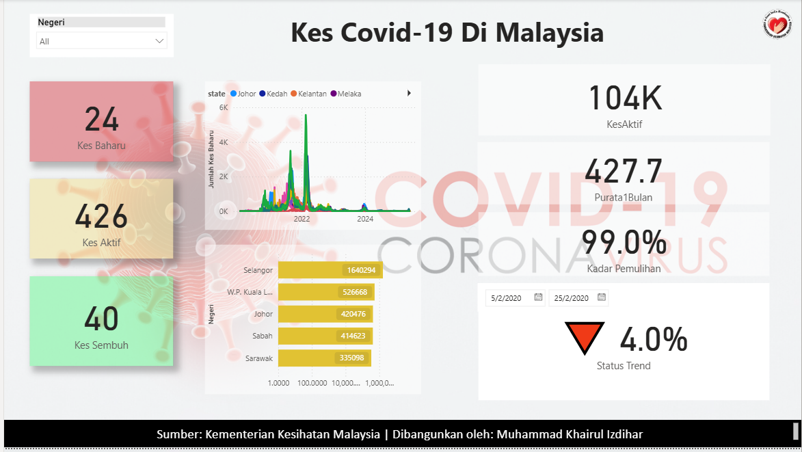
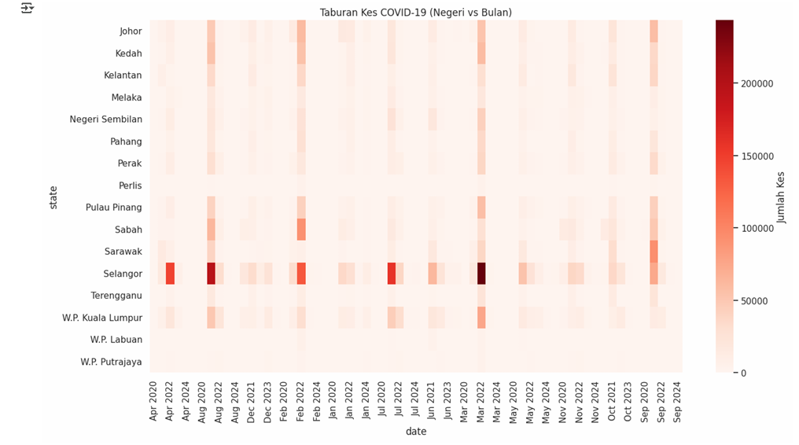

# Data-Analytic-Project
Portfolio projects in Power BI and Python by Khairul Izdihar
# 📊 Data Analytics Portfolio — Khairul Izdihar

Dua projek utama menggunakan **Power BI dan Python** untuk analisis COVID-19 di Malaysia.

## 1) Power BI — COVID-19 Dashboard
- KPI cards (Kes Harian, Kes Aktif, Kadar Pemulihan, Status Trend), slicer Negeri & Tarikh, Top 5 Negeri.
- 📁 Fail: [PowerBI Portfolio.pbix]([powerbi/PowerBI Portfolio.pbix](https://github.com/IzdiharKhai/Data-Analytic-Project/raw/main/powerbi/PowerBI%20Portfolio.pbix
)
- 🖼️

## 2) Python — COVID-19 Data Analysis
- Data cleaning (pandas), visualisasi (line, bar, heatmap), trend tahunan Top 3 negeri.
- 📁 Notebook: [`python/covid19_analysis.ipynb`]([python/Covid19 analysis.ipynb - Colab.pdf](https://github.com/IzdiharKhai/Data-Analytic-Project/blob/main/python/Covid19%20analysis.ipynb%20-%20Colab.pdf))
- 🖼️

---

### Skills
Power BI (DAX, Dashboarding) · Python (Pandas, Matplotlib, Seaborn)

### Contact
Email: khairulizdihar2311@gmail.com · LinkedIn: *letak link awak di sini*
